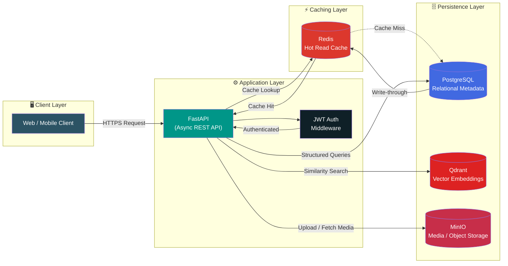

<div align="center">


<br/>

<a href="https://www.linkedin.com/in/vardaan-shukla-b63b54264/">
  
</a>
<a href="mailto:vardaan.shukla7@gmail.com">
  
</a>
<a href="https://leetcode.com/u/Vardaan28/">
  
</a>
<a href="https://github.com/vardaan-7">
  
</a>

<br/><br/>


</div>

<br/>

## `01` About Me

I build systems that survive contact with production — not notebooks that die in a Jupyter cell. My work sits at the intersection of **AI/ML and backend engineering**: I take models and data pipelines and wrap them in the infrastructure that actually ships — REST APIs, caching layers, auth, containerized services, and persistent storage.

```txt
class Vardaan(BackendEngineer):
    def __init__(self):
        self.degree      = "B.Tech CSE (AI/ML), VIT Bhopal University"
        self.focus       = ["API Design", "Distributed Systems", "DB Scaling", "DevOps"]
        self.philosophy  = "If it can't be deployed, it isn't finished."
        self.status      = "Actively seeking Backend Engineering internships/roles"

    def currently_building(self):
        return "Artist Collaboration Engine — a location-aware discovery " \
               "platform for independent musicians"
```

Most of my projects are deliberately built as **simulations of real-world production domains** — marketplaces, delivery logistics, fintech dashboards, and computer-vision pipelines — because the goal isn't "does it run," it's "could this survive a code review from a senior backend engineer."

<br/>

## `02` Featured Projects

<table width="100%">
<tr>
<td width="100%">

### 🎵 Artist Collaboration Engine <sub><i>(flagship project)</i></sub>

**A location-aware discovery and collaboration platform for independent artists in the Indian music scene**, designed around a real production data stack rather than a single monolithic service.

**Engineering highlights**
- 🔎 Semantic, location-aware artist matching using **vector similarity search** (Qdrant) instead of naive keyword filtering
- ⚡ **Redis** caching layer in front of hot read paths to cut redundant PostgreSQL/Qdrant round-trips
- 🗄️ Clean separation of concerns — relational metadata in **PostgreSQL**, unstructured media in **MinIO** (S3-compatible object storage), embeddings in **Qdrant**
- 🔐 **JWT-based auth** for stateless, horizontally-scalable session handling
- 🐳 Fully containerized, multi-service local dev environment via **Docker Compose**

<p>


</p>

<details>
<summary><b>📐 View System Architecture Diagram</b></summary>
<br/>



**Request flow:** client → FastAPI → JWT validation → Redis cache check → on miss, fan-out to PostgreSQL (metadata) and Qdrant (vector similarity) → MinIO for media assets → response, with write-through cache population to keep subsequent reads fast.

</details>

📎 [`github.com/vardaan-7/Artist-collab`](https://github.com/vardaan-7/Artist-collab)

</td>
</tr>
</table>

<br/>

<table width="100%">
<tr>
<td width="50%" valign="top">

### 🍽️ ByteDine
Backend-focused food delivery system modeling restaurants, users, delivery agents, and the full order lifecycle through clean **OOP domain design**.

**Focus:** entity modeling, state transitions, order-matching logic


📎 [`github.com/vardaan-7/ByteDine`](https://github.com/vardaan-7/ByteDine)

</td>
<td width="50%" valign="top">

### 📈 MarketLens
Full-stack fintech application for stock analysis — technical indicators, backtesting, and risk-aware trend prediction across a MERN + Python pipeline.

**Focus:** data pipelines, backtesting engines, full-stack integration


📎 [`github.com/vardaan-7/MarketLens`](https://github.com/vardaan-7/MarketLens)

</td>
</tr>
<tr>
<td width="50%" valign="top">

### 🚗 Vehicle Tracking System
Computer-vision pipeline for real-time detection, tracking, and monitoring of vehicles across video streams.

**Focus:** frame-level inference pipelines, tracking algorithms


📎 [`github.com/vardaan-7/Vehicle-tracking-project`](https://github.com/vardaan-7/Vehicle-tracking-project)

</td>
<td width="50%" valign="top">

### 🔜 More in progress
Actively hardening repo hygiene (READMEs, `.env.example`, CI/CD) across projects and shipping v1 of the Artist Collaboration Engine.


</td>
</tr>
</table>

<br/>

## `03` Dashboard

<table width="100%">
<tr>
<td width="50%" valign="top">

</td>
<td width="50%" valign="top">

</td>
</tr>
<tr>
<td width="50%" valign="top">

</td>
<td width="50%" valign="top">

</td>
</tr>
</table>

**LeetCode contribution heatmap**

<div align="center">

</div>

**GitHub contribution graph**

<div align="center">

</div>

<details>
<summary><b>🏆 GitHub Trophies</b></summary>
<br/>
<div align="center">

</div>
</details>

> ⚠️ **Why cards break:** these are all free, shared, no-auth widget services (Vercel-hosted). They occasionally rate-limit or go down — it's not your README, it's their server load. See the fix notes below the table if a card is still blank after a hard refresh.

<br/>

## `04` Technical Core Competencies

<table width="100%">
<tr><th align="left" width="30%">Domain</th><th align="left">Depth</th></tr>
<tr>
<td valign="top"><b>🗄️ Database Scaling</b></td>
<td>

PostgreSQL schema design & indexing strategy · vector embedding indexes (Qdrant HNSW) for approximate nearest-neighbor search at scale · query optimization over naive ORM defaults

</td>
</tr>
<tr>
<td valign="top"><b>⚡ Async API Architecture</b></td>
<td>

FastAPI async request pipelining · non-blocking I/O for high-concurrency endpoints · JWT-based stateless auth for horizontal scalability

</td>
</tr>
<tr>
<td valign="top"><b>🐳 Container Orchestration</b></td>
<td>

Docker & multi-service Docker Compose networks · service isolation and inter-container communication · reproducible local dev environments

</td>
</tr>
<tr>
<td valign="top"><b>🧊 Data Caching Strategy</b></td>
<td>

Redis read-through / write-through caching layers · hot-path latency reduction · cache invalidation strategy for consistency with source-of-truth stores

</td>
</tr>
<tr>
<td valign="top"><b>🤖 AI/ML Foundations</b></td>
<td>

Machine learning & deep learning fundamentals · vector search & semantic similarity · recommendation system design bridging ML output to production APIs

</td>
</tr>
</table>

<br/>

## `05` Full Toolbox

<div align="center">


<br/>


<br/>


<br/>


</div>

<br/>

## `06` Let's Build Something

I'm currently shipping **v1 of the Artist Collaboration Engine** and sharpening backend fundamentals around system design, DB scaling, and auth — and always up for collaborating on **distributed systems, API scalability, or anything backend-heavy.**

Actively looking for **backend engineering internships / entry-level roles**. If your team is solving hard infrastructure problems, my inbox is open.

<div align="center">

<a href="https://www.linkedin.com/in/vardaan-shukla-b63b54264/">
  
</a>
<a href="mailto:vardaan.shukla7@gmail.com">
  
</a>

<br/><br/>


</div>
